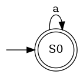
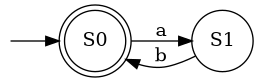
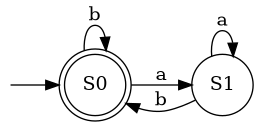

# Adaptive k-tails Automata Inference
Adaptive k-Tails approach for automata inference with automatic k-vector optimisation using hill-climbing and neural networks.

## Data
The data used in this project is available in the `data/` directory.  
It contains the zip files of the datasets used for training and testing the adaptive k-Tails approach.  
To unzip the files, you can use the following command in the terminal:
```bash
unzip data/{dataset}.zip -d data/
```

This will extract the contents of the zip file into the `data/` directory.  
Make sure to replace `{dataset}` with the actual name of the dataset you want to extract.

## Tests

This project includes a set of unit tests to validate the behaviour of the automaton and k-tail implementation.  
Each test case represents a different structural pattern in automata.

<details>
<summary>Click to expand test cases</summary>

### Case 1: Self-loop

- **Description**:  
  A single state with a transition looping back to itself.

- **Purpose**:  
  Tests basic trace generation and acceptance in the simplest possible automaton.

- **Visualization**:  
  

---

### Case 2: Mutual Circle

- **Description**:  
  Two states alternating transitions between each other.

- **Purpose**:  
  Validates behaviour across multiple states and transition switching.

- **Visualization**:  
  

---

### Case 3: Cyclic

- **Description**:  
  Two states with both self-loops and cross transitions, allowing multiple possible paths.

- **Purpose**:  
  Tests whether the k-tail algorithm correctly returns all possible future transitions, not just one path..


- **Visualization**:  
  

</details>

### Running Tests

Run all tests using:

```bash
pytest
# For more detailed output:
pytest -v
```