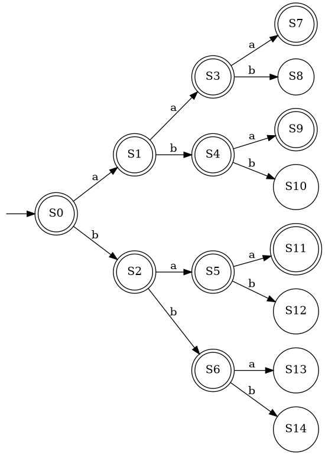
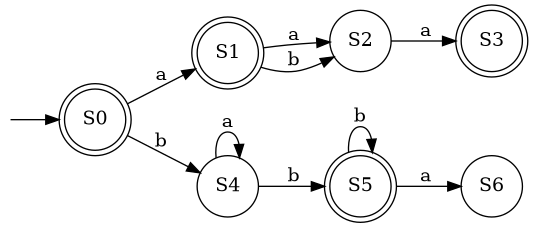
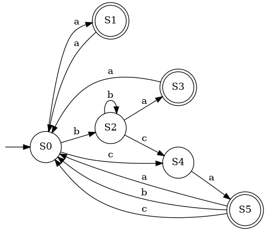
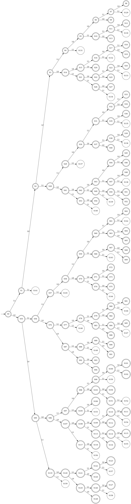

# Adaptive k-tails Automata Inference
Adaptive k-Tails approach for automata inference with automatic k-vector optimisation using hill-climbing and neural networks.

## Data
The data used in this project is available in the `data/` directory.  
It contains the zip files of the datasets used for training and testing the adaptive k-Tails approach.  
To unzip the files, you can use the following command in the terminal:
```bash
unzip data/{dataset}.zip -d data/
```

This will extract the contents of the zip file into the `data/` directory.  
Make sure to replace `{dataset}` with the actual name of the dataset you want to extract.

## Tests

This project includes a set of unit tests to validate the behaviour of the automaton and k-tail implementation.  
Each test case represents a different structural pattern in automata.

<details>
<summary>Click to expand test cases</summary>

### Structure

```
tests/
├── k_tail/
├── can_merge/
├── do_single_merge/
├── testcase/
│   ├── k_tail/
│   ├── can_merge/
│   └── do_single_merge/
```

### What is Tested

**k_tail**: Tests the function **compute_state_k_tail(state_id, k)**  
**can_merge**: Tests the function **can_merge(keep_state_id, delete_state_id)**  
**do_single_merge**: Tests the function **do_single_merge(keep_state_id, delete_state_id)**  

### Test Cases

**Case 1** : Selected branch of a PTA  
  

**Case 2** : Simple PTA with loops and alternating accept states  
  

**Case 3** : Complex automaton  
  

**Case 5220** : PTA from `automaton_5_2_2_0~0.txt`  


</details>

### Running Tests

Run from project root directory using the following command:

```bash
# Run all tests
pytest

# Run specific test file
pytest tests/k_tail/test_k_tail_1.py

# Run multiple test files
pytest tests/k_tail/*
pytest tests/can_merge/*
pytest tests/do_single_merge/*

# For more detailed output
pytest -v
pytest -vv
```